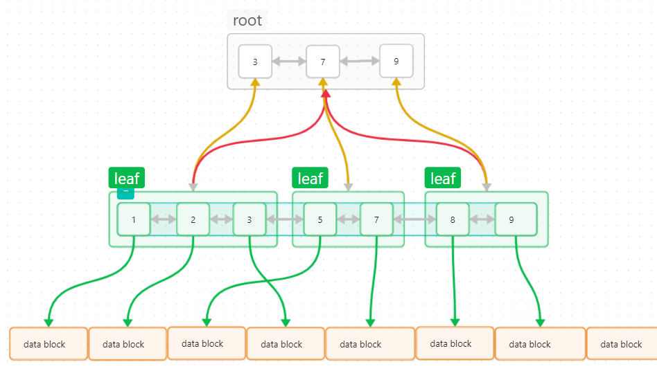

# V3版本
> - 源码位置: src/main/com/BPlusTree/V3
> - 测试文件位置: test/java/com/BPlusTree/V3

## 特点

| 版本  | 插入  | 删除  | 查找  | 修改  | 持久化 |
|-----|-----|-----|-----|-----|-----|
| V3  | √   | √   | √   | √   | ×   |

- 节点页使用链表的形式
  > 由于官方库的链表不能直接操作节点, 且不有序, 相当于每次都要从头节点开始, 效率很低, 所以这里自己实现了一个有序链表
  > : src/main/java/com/BPlusTree/SortedLinkList
- 数据节点用有序链表串起来 (V2版本是使用的普通链表串联节点页)
- 包含普通索引和唯一索引两种方式

## 结构

- 一个父节点对应一个子页面(子节点集合), 父节点的值是子节点里的最大值
- 节点页使用链表的形式
- 数据节点用有序链表串起来

## 算法

### 查找

在当前页开始查找索引为 key 对应的节点 leNode
1. 查找当前页第一个 >=key 的节点
  > 如果没找到, 直接返回 null
2. 如果当前页不为叶子节点, 在子页 leNode.children 页继续查找
3. 为叶子节点, 如果 leNode.key != key, 没有满足要求的节点, 返回 null
4. 如果为唯一索引, 只存在一个满足要求的值, 直接返回 leNode.data
5. 不为唯一索引, 可能存在多个满足要求的值, 从 leNode.leafTreeNode 开始在叶子节点链表查找所有索引为 key 的值

### 更新

与查找的思路是一样的, 查找是查找满足要求的节点, 更新里找到这些节点后, 把这些节点的值更新成新值就可以了

### 插入

在当前页开始尝试插入键值对 [key: value]
1. 在当前页查找第一个 >= key 的节点 leNode
2. 如果为叶子节点
   1. 如果 leNode 为 null, 表示 key 是最大值
      1. 维护叶子链表: 在当前页最后一个索引节点后面添加新叶子节点
         > 如果当前页没有索引, 当且仅当什么也没有时才可能存在这种情况,此时叶子链表也为空, 直接尾部添加一个叶子节点即可
      2. 当前页在末尾插入 [key: value]
   2. leNode不为null
      1. 维护叶子链表: 在 leNode 对于的叶子节点前面添加新叶子节点
      2. 当前页在 leNode 前面插入新节点
   3. 如果当前页节点个数超出阶数, 分裂当前节点(见分裂算法)
3. 不为叶子节点
   1. 如果 leNode 为 null, 表示 key 是最大值
      1. 更新最大值(即最后一个节点)的索引为 key
      2. 在最后一个节点的子节点页 尝试插入 [key:value]
   2. leNode不为null, 在子节点页 leNode.children 尝试插入新节点

### 删除
> 需要考虑一个比较复杂的情况就是非唯一索引, 删除一个 key 可能要删除多个节点, 这些节点可能在多个页里面

在当前页开始尝试删除键 key 对应的值
1. 在当前页查找第一个索引 >= key 的节点 leNode
2. 如果 leNode 为 null, 没找到, 直接 return
3. 如果当前页为叶子页, 从 leNode 开始遍历删除索引为 key 的节点, 假设当前遍历到的节点为 eNode
   1. 如果 eNode == null, 表示当前页满足条件的被删完了, 但是下一页可能还有, 继续在下一页执行删除算法
   2. 如果 eNode.key != key, 跳出循环 
   3. 维护叶子链表: 叶子链表里直接删除这个节点
   4. 当前页删除 eNode
   5. 可能移除了最后一个节点, 这种情况需要更新当前页在父页里的索引
   6. 如果当前页节点个数 < degree/2, 拓展|合并 当前页(见 拓展|合并 算法)
4. 如果当前页不为叶子页, 去子页 leNode.children 继续尝试删除

### 分裂算法

将当前页分成左右两个界面
> 条件: 页面的阶数 > 阶数
1. 为根页, 分裂成两个子页, 根页面设置两个字页索引
2. 不为根页, 分裂成两个页, 父页面新添加一个索引, 如果父页面节点数也超出阶数, 继续分裂父页面

### 拓展|合并 算法

将当前页拓展到节点个数 >= 阶数/2

> 条件:
> 1. 不为根页
> 2. 当前页的节点数 < degree/2

1. 如果没有兄弟页, 只用考虑一种情况: 当前页没有节点了, 需要删除父页的索引(见删除索引算法)
2. 如果有兄弟页(这里优先考虑右边的兄弟)
   1. 如果兄弟页的节点个数 > degree/2, 向兄弟借一个
   2. 如果兄弟页的节点个数也不够, 合并兄弟页
   3. 更新自己或者兄弟页的索引(见更新索引算法)

### 更新索引算法
> 条件: 不为根页

不单是更新当前页在父页里的索引, 如果父页里的索引为最后一个节点, 需要继续向上更新父页的索引

### 删除索引算法
> 条件: 不为根页

删除当前页在父页里的索引后, 需要考虑两种情况:
1. 父页面里的节点被删完了, 需要继续向上删除父页面的索引
2. 删除的是父页面里的最大值, 需要更新父页的索引
      

## 父子节点关系

current 表示当前页, parent 表示父页
1. current.parentPage = parent, 
2. current.parentKeyNode in parent.nodes // 索引
3. current.parentKeyTreeNode.children = parent // 索引节点子页面
4. 对于 current.nodes: 
   - 如果 current 不是叶子, node.children -> current 是 node.children 的父界面, 对 node.children 进行第 1, 2, 3步
   - node.page = current // 所属页
   - node.keyListNode in current.nodes // 索引链表节点